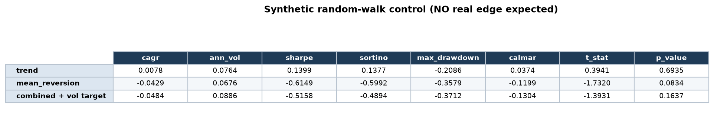
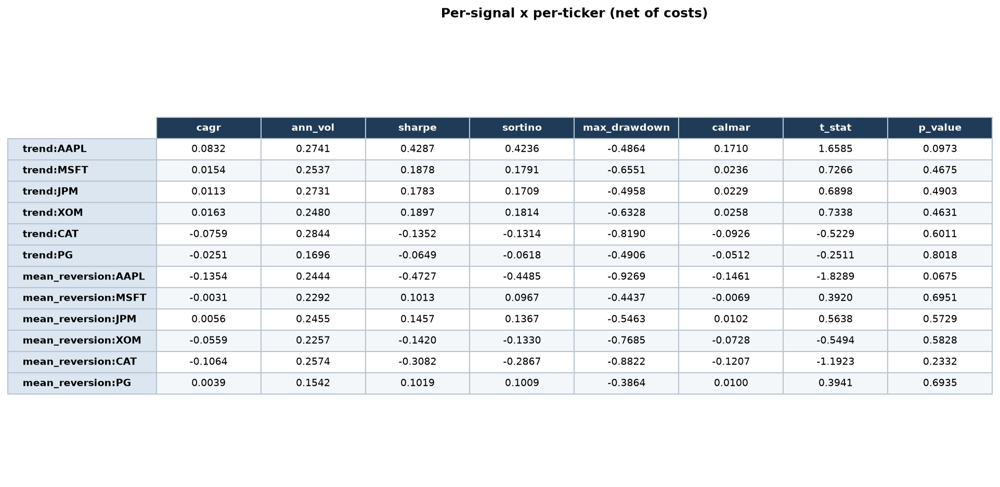
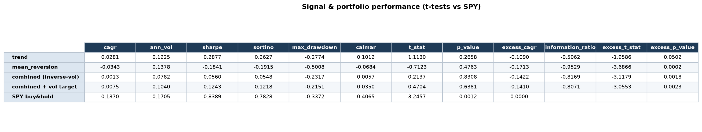
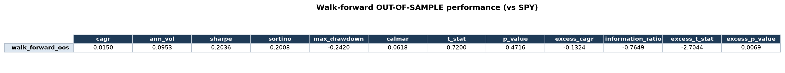
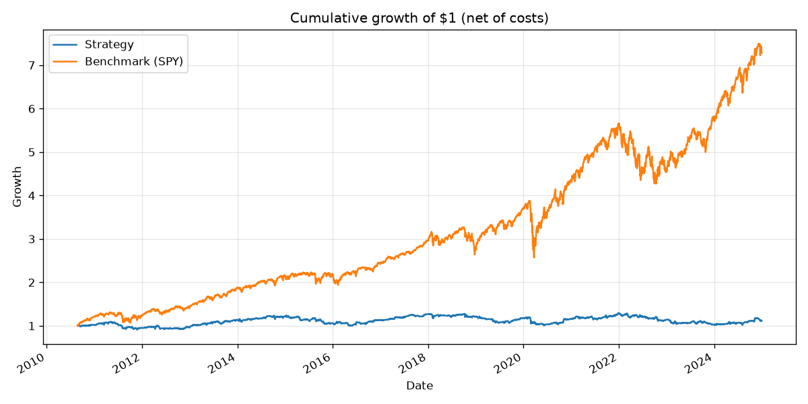
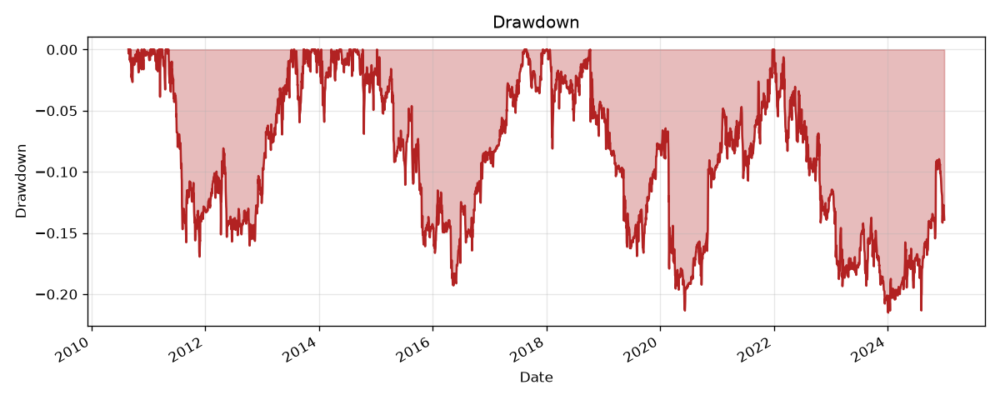
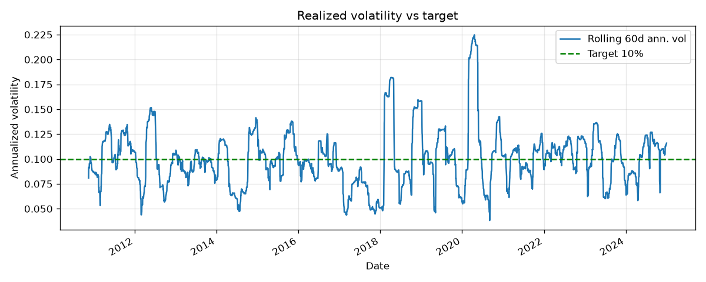
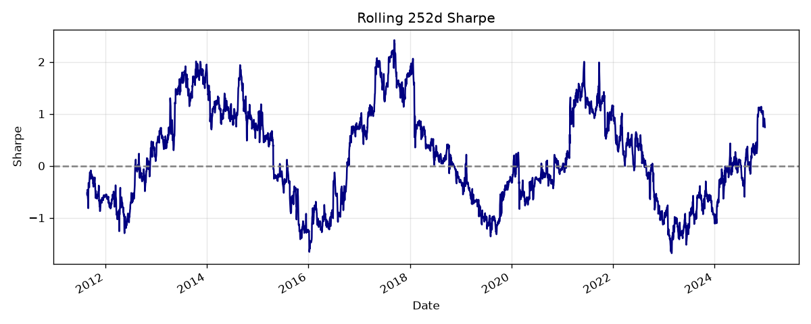

# Systematic Multi-Signal Equity Strategy with Risk-Adjusted Backtesting

A systematic equity trading **research framework** that combines two independent
signals — a **trend-following** signal (EMA fast/slow crossover) and a
**mean-reversion** signal (rolling z-score with entry/exit bands) — into a single
risk-managed portfolio, and evaluates it the way a real trading desk would:
**net of realistic trading costs, risk-allocated across signals, scaled to a
target volatility, and judged on risk-adjusted + statistically significant terms**,
with **walk-forward out-of-sample validation** to guard against overfitting.

Rather than backtesting a signal and reporting raw P&L, the framework is built to
answer the questions a desk actually asks:

- **Does the signal survive transaction costs?** A market-impact-aware cost model
  (fixed cost + impact that scales with trade size relative to average daily
  dollar volume) is applied *before* any return is counted as real.
- **How should capital be allocated across signals?** The two signals are combined
  with inverse-volatility ("risk parity") weighting, so each contributes risk
  proportional to `1/volatility` rather than notional size.
- **How much risk should the combined book take?** The blended portfolio is scaled
  to a target annualized volatility (with a leverage cap), using only trailing,
  already-known data to avoid lookahead.
- **Is the edge real, or noise?** Every result carries Sharpe, Sortino, max
  drawdown, and Calmar, plus a one-sample t-test on mean daily returns and a
  benchmark comparison (vs. SPY buy-and-hold) with its own t-test on excess
  returns.
- **Would it have worked out-of-sample, or is it overfit?** A walk-forward process
  re-optimizes signal parameters on a rolling in-sample window by Sharpe, then
  evaluates strictly on the following out-of-sample window.

As a sanity check, the framework is run on **synthetic random-walk data** (pure
noise, no real signal) and correctly reports **no statistically significant edge** —
confirming the evaluation methodology doesn't manufacture false positives.

---

## Table of contents

1. [How it works (pipeline)](#how-it-works-pipeline)
2. [The two signals](#the-two-signals)
3. [Transaction cost model](#transaction-cost-model)
4. [Capital & risk allocation](#capital--risk-allocation)
5. [Metrics & significance testing](#metrics--significance-testing)
6. [Walk-forward validation](#walk-forward-validation)
7. [Negative control (synthetic noise)](#negative-control-synthetic-noise)
8. [Project layout](#project-layout)
9. [Setup & run](#setup--run)
10. [Results](#results)
11. [Configuration reference](#configuration-reference)
12. [Limitations & next steps](#limitations--next-steps)

---

## How it works (pipeline)

Every stage below uses **only trailing information**, and the one-bar execution
lag is applied in a single place (`backtest.run_signal`) so the no-lookahead
property is centralized and unit-tested.

```
price data (yfinance, cached)
   │
   ├── trend signal  (EMA crossover)       ─┐
   └── mean-reversion signal (z-score)      │   per-ticker target positions {-1,0,+1}
                                            │
        shift(1)  →  earn next-bar return   │   ← execution lag (no lookahead)
        subtract transaction costs          │   ← fixed + market-impact
        equal-weight across tickers         │
                                            ▼
        per-signal net return streams  ──►  inverse-vol combine (risk parity)
                                            ▼
                                    volatility targeting (cap leverage)
                                            ▼
                              final combined book  →  metrics vs SPY, plots
                                            ▼
                              walk-forward (IS optimize → OOS evaluate)
```

## The two signals

Each signal maps a close-price series to a **target position in {-1, 0, +1}** per
ticker. ([`src/systematic_strategy/signals.py`](src/systematic_strategy/signals.py))

**Trend-following — EMA crossover.** Long when the fast EMA is above the slow EMA,
short otherwise; flat during the slow-EMA warm-up:

```
position_t = sign( EMA_fast(close)_t − EMA_slow(close)_t )
```

**Mean-reversion — rolling z-score with bands.** Fade extremes: go long when price
is `entry` standard deviations *below* its rolling mean, short when `entry` above,
and flatten once the z-score reverts inside `exit`. State is carried forward (a
position is held until an exit or an opposite entry fires):

```
z_t = (close_t − rolling_mean_W) / rolling_std_W
enter long  if z_t ≤ −entry ;  enter short if z_t ≥ +entry
exit (flat) if |z_t| ≤ exit
```

## Transaction cost model

Costs are charged on every position change as a fractional drag on that bar's
return, with a **fixed** part (spread/commission) and a **market-impact** part
that grows with the *participation rate* — traded notional relative to trailing
average dollar volume (ADV). ([`src/systematic_strategy/costs.py`](src/systematic_strategy/costs.py))

```
participation = |trade_notional| / ADV_window
cost_frac     = |Δweight| · (fixed_bps/1e4)  +  (impact_coef_bps/1e4) · participation · |Δweight|
```

Trading a name large relative to its liquidity moves the price against you, so
impact scales with participation. Returns are **always reported net of these
costs**, so a signal must clear its own frictions before it looks attractive.

## Capital & risk allocation

([`src/systematic_strategy/portfolio.py`](src/systematic_strategy/portfolio.py))

**Inverse-volatility weighting** blends the two signal return streams so each
contributes equal *risk*, not equal notional:

```
w_i = (1/vol_i) / Σ_j (1/vol_j)        (trailing window, shifted one bar)
```

**Volatility targeting** then scales the blended book toward an annualized target,
subject to a leverage cap — using trailing realized vol only:

```
scale_t = min( vol_target / realized_vol_{t−1..} ,  leverage_cap )
```

## Metrics & significance testing

([`src/systematic_strategy/metrics.py`](src/systematic_strategy/metrics.py))
Every return series is scored with **CAGR, annualized vol, Sharpe, Sortino, max
drawdown, Calmar**, a **one-sample t-test** on mean daily return (is the mean
distinguishable from zero?), and — against SPY — **excess CAGR, information ratio,
and a t-test on daily excess returns** (is the strategy distinguishable from the
benchmark?). Reporting significance, not just P&L, is what separates a real edge
from a lucky path.

## Walk-forward validation

([`backtest.walk_forward`](src/systematic_strategy/backtest.py)) On each fold the
parameter grid is scored on a rolling **in-sample** window by Sharpe of the
combined vol-targeted book, and the winning parameters are applied to the
**following out-of-sample** window only. OOS segments are stitched into one honest
track record — parameters are never scored on the data that chose them. Windows
default to 504 in-sample / 126 out-of-sample trading days.

## Negative control (synthetic noise)

([`scripts/run_synthetic.py`](scripts/run_synthetic.py)) The *exact same pipeline*
is fed driftless geometric random-walk prices. A sound methodology should find
**no significant edge** here; if it did, the framework would be manufacturing
false positives. This run asserts the combined book's t-test p-value is not
significant.

---

## Project layout

```
config.py                       # all tunables (universe, dates, signal/cost/risk/WF params)
src/systematic_strategy/
  data.py        # yfinance download + parquet cache; ADV for participation
  signals.py     # EMA crossover + z-score mean-reversion -> target positions {-1,0,+1}
  costs.py       # fixed + market-impact transaction cost model
  portfolio.py   # inverse-vol signal weighting + volatility targeting (trailing-only)
  metrics.py     # Sharpe/Sortino/MaxDD/Calmar + t-tests + information ratio
  backtest.py    # engine (positions->net returns) + walk-forward validation
  plotting.py    # equity curve, drawdown, rolling vol/Sharpe -> figures/
scripts/
  run_backtest.py   # end-to-end on real tickers + SPY
  run_synthetic.py  # random-walk negative control
tests/              # pytest suite (signals, costs, portfolio, metrics, backtest)
```

## Setup & run

```bash
python3 -m venv .venv
source .venv/bin/activate
pip install -r requirements.txt

pytest                          # unit tests (28)
python scripts/run_synthetic.py # negative control: expect NO significant edge
python scripts/run_backtest.py  # full backtest: tables + walk-forward + figures/
```

The first `run_backtest.py` needs network access (yfinance); data is then cached
to `data/cache/` so subsequent runs are reproducible and offline-capable.

---

## Results

> Reproduced from `python scripts/run_backtest.py` and `run_synthetic.py`.
> Universe **AAPL, MSFT, JPM, XOM, CAT, PG**; benchmark **SPY**; period
> **2010-01-01 → 2024-12-31**. Returns are **net of the transaction-cost model**.
> `cagr`, `ann_vol`, and `max_drawdown` are decimals (e.g. `0.0281` = 2.81%).

### 1. Negative control — synthetic random walk (no real edge expected)



**Combined-book t-test p-value = 0.164 (α = 0.05) → PASS:** no statistically
significant edge on pure noise, exactly as intended.

### 2. Per-signal × per-ticker (net of costs)



### 3. Signal & portfolio performance (full sample, t-tests vs SPY)



**Risk controls (verified live):** vol-target book realized annualized vol =
**10.40%** vs **10%** target; applied leverage max = **2.00** vs cap **2.00**.

### 4. Walk-forward OUT-OF-SAMPLE performance (vs SPY)



25 folds; parameters re-optimized on each 504-day in-sample window and evaluated on
the next 126-day out-of-sample window. Notably the OOS Sharpe (0.20) is *in line
with* the full-sample combined Sharpe (0.12) — the strategy is not dramatically
better in-sample than out, i.e. it is **not obviously overfit** (it's just weak).

### 5. Figures

Written to `figures/` on every backtest run:

| | |
|---|---|
|  |  |
|  |  |

---

## Configuration reference

All knobs live in [`config.py`](config.py) as dataclasses with documented defaults:

| group | fields (defaults) |
|---|---|
| Universe / dates | `tickers=[AAPL,MSFT,JPM,XOM,CAT,PG]`, `benchmark=SPY`, `start=2010-01-01`, `end=2024-12-31` |
| Trend | `ema_fast=20`, `ema_slow=100` |
| Mean-reversion | `z_window=20`, `z_entry=1.0`, `z_exit=0.25` |
| Costs | `fixed_bps=1.0`, `impact_coef_bps=10.0`, `adv_window=20` |
| Risk | `iv_window=60`, `vt_window=60`, `vol_target=0.10`, `leverage_cap=2.0` |
| Walk-forward | `is_days=504`, `oos_days=126`, plus small param grids searched per fold |


## Limitations & next steps

- Signals are intentionally simple; the framework is the deliverable, not this
  parameter set. Natural extensions: a broader universe, sector/beta
  neutralization, richer signals (carry, breakout, vol-adjusted momentum), and a
  turnover penalty in the walk-forward objective.
- Costs are a stylized fixed+linear-impact model; a square-root impact law and
  per-name spread estimates would be more realistic.
- Daily bars only; no intraday execution or borrow/financing modeling.
```

_This README's result tables were generated by running the project; re-running the
scripts regenerates them (values are deterministic given the cached data)._
